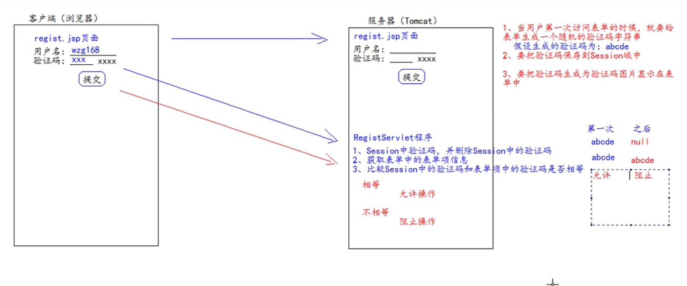

# book
**基于javaweb的书城项目，适合于新手入门巩固基础。**
**此文档讲简要介绍整个项目中难度较高的需求的实现**

- #### 用户登录信息回显

  > 用户登录之后需要显示用户名等信息，每个涉及到用户信息的界面的都需要显示用户信息，最佳的解决方案是将用户信息存储在session域中，前端页面只需要获取session域中的用户信息即可
  
- #### 谷歌验证码解决表单信息重复提交

  > ##### 表单重复提交的三种常见的情况
  >
  > 1. 提交表单之后，服务器使用请求转发进行页面跳转，但用户按下功能键F5，会发起最后一次的请求，造成表单重复提交。解决方法是使用重定向进行跳转
  > 2. 用户正常提交服务器，但是由于网络延迟等原因，迟迟未收到服务器的响应，这个时候用于以为表单提交失败，便多提交了几次。
  > 3. 用户正常提交，服务器响应正常，但是用户退出浏览器重新提交。
  >
  > 上述2，3两种情况都适合用验证码解决。
  >
  > 验证码解决表单重复提交原理
  >
  > 
  >
  > 谷歌验证码依赖
  >
  > ```xml
  > <!-- https://mvnrepository.com/artifact/com.google.code/kaptcha -->
  > <dependency>
  >     <groupId>com.google.code</groupId>
  >     <artifactId>kaptcha</artifactId>
  >     <version>2.3.0</version>
  > </dependency>
  > ```
  >
  > 在`web.xml`中配置
  >
  > ```xml
  >   <!--谷歌验证码-->
  >   <servlet>
  >     <servlet-name>KaptchaServlet</servlet-name>
  >     <servlet-class>com.google.code.kaptcha.servlet.KaptchaServlet</servlet-class>
  >   </servlet>
  >   <servlet-mapping>
  >     <servlet-name>KaptchaServlet</servlet-name>
  >     <url-pattern>/kaptcha.jpg</url-pattern>
  >   </servlet-mapping>
  > ```
  >
  > 生成的谷歌验证码保存在session域中，取出之后马上删除
  >
  > ```java
  >  //获取session中的验证码
  >         String token = (String)request.getSession().getAttribute(KAPTCHA_SESSION_KEY);
  >         System.out.println(token);
  >         request.getSession().removeAttribute(KAPTCHA_SESSION_KEY);
  > ```
  >
  > 

